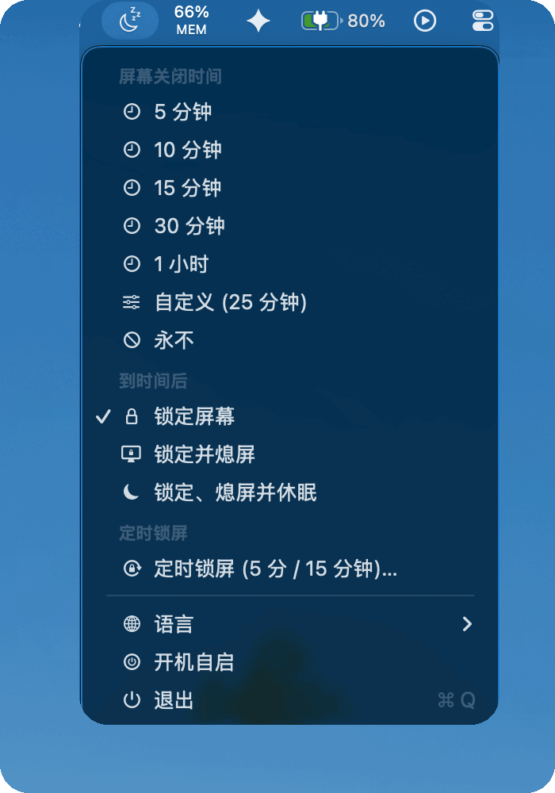
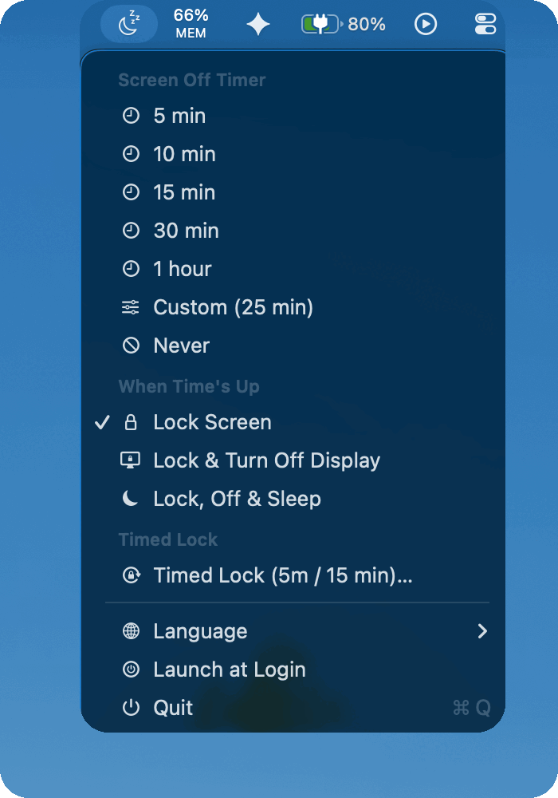

<div align="center">

# 🌙 SleepBar

**A lightweight macOS menu bar timer that locks, dims, or sleeps your Mac after a countdown.**

*Set a screen-off timer before bed — give your Mac one last task and let it auto-lock or sleep when time's up.*

**English** · [简体中文](README.zh-CN.md)


</div>

---

## What is this?

Before going to sleep you often want to leave your Mac running for a little longer — until a script finishes, an AI agent completes a task, or a download wraps up. But the macOS **"turn display off"** delay is a *fixed* setting: 5 minutes this time, 1 hour the next — and changing it means digging into System Settings every single time.

**SleepBar** moves that control to your menu bar. Click the icon, pick a duration, and your screen stays awake for exactly that long. When the countdown ends, your Mac **automatically locks, turns off the display, or even goes to sleep** — whatever you chose. Your task finishes, and your Mac rests.

> No system settings are modified and no `sudo` is required. The moment the timer ends, everything returns to normal.

## ✨ Features

- ⏱️ **Countdown screen-off** — presets of 5 / 10 / 15 / 30 min, 1 hour, or **any custom duration**. The remaining time ticks live in the menu bar.
- ⚡ **Now** — skip the countdown and run your chosen action (lock / turn off display / sleep) immediately, in one click.
- 🔒 **Lock screen** — lock to the login window when time's up.
- 🖥️ **Turn off display** — lock *and* power down the display to save energy.
- 🌑 **Screen Off (no lock)** — a black screen without locking: built-in brightness → 0, external display → DDC power-off, keyboard backlight → 0, and the audio output **muted** (level dropped to 1%). The system stays awake so the GPU keeps rendering — ideal for leaving a render or an AI task running overnight. Move the mouse *or press a key* and brightness, backlight, volume and mute state all come back.
- 💤 **Sleep** — put the whole Mac to sleep when the timer ends.
- ♾️ **Keep awake forever (Never)** — one click to keep the screen on indefinitely; great for long tasks, presentations, or watching videos.
- ☕ **Keep Awake** — a standalone toggle (below **Language**) that stops the Mac from going to sleep for as long as it's checked; the display can still turn off normally. Independent of the countdown, remembered across restarts, and released automatically when an end action deliberately puts the Mac to sleep.
- 🔁 **Timed Lock** — *“lock after **5 min** idle, for the next **2 hours**.”* Two numbers, one sentence: how long of no input triggers a lock, and how long the whole thing runs. SleepBar then auto-locks every time you've been idle that long, re-arming after each unlock, until the time's up. The "run for" duration is a fixed countdown — locking or unlocking never resets it. **No permissions required** (reads system idle time only, never intercepts input).
- 🕹️ **System Display Off control** — see the system's *"Turn display off when inactive"* time (from `pmset`, no permissions needed) right in the menu, and change it to any macOS pillar (1 min – 3 hours, or Never) in two clicks. Writing asks for your admin password once — that's a macOS requirement for power settings.
- 🌙 **Auto Screen Off 1 min early** — macOS may demand a password after the system turns the display off, even when you told it not to. Turn this on and SleepBar fires its own no-lock **Screen Off** one minute *before* the system deadline (e.g. at 29 min when the system is set to 30), keeping the machine awake behind a black screen — move the mouse and you're back instantly, no password. Adapts automatically if you change the system time or switch between battery and AC.
- 🧠 **Remembers your custom duration** — your last value is saved and pre-filled, so your favorite time is one click away.
- 🌐 **7 languages** — English, 中文, Español, العربية, Português (Brasil), 日本語, Deutsch. Switch the entire menu instantly; follows your system language on first launch.
- 🔔 **Update check** — every 14 days SleepBar quietly asks GitHub whether a newer release exists. If so, one item appears at the top of the menu that opens the download page. It never downloads or installs anything — updating stays your decision, and the check is a single anonymous request that sends nothing about you.
- 🪶 **Extremely lightweight** — a single Swift file, zero dependencies, no background service. **~0% CPU when idle.**

## 📸 Screenshots

| Chinese UI | English UI |
|:---:|:---:|
|  |  |

## 🚀 Installation

### Option 1 — One line (recommended)

```bash
curl -fsSL https://raw.githubusercontent.com/ddasy/SleepBar/main/install.sh | bash
```

### Option 2 — Clone, then install

```bash
git clone https://github.com/ddasy/SleepBar.git
cd SleepBar
./install.sh
```

The installer automatically: **checks the Swift toolchain → compiles → builds `~/Applications/SleepBar.app` → adds the `sleepbar` shell alias → starts the app with launch-at-login enabled.** No `sudo` needed — everything lives in your home directory. The 💤 icon appears in your menu bar right away and **launches automatically on every login** (toggle anytime: menu-bar icon → **Launch at Login**).

Quit it by accident? Start it again with **Spotlight (⌘Space) → SleepBar**, or just type:

```bash
sleepbar
```

> The `sleepbar` alias lives in `~/.zshrc`, so it works in Terminal windows opened after the install.

> If prompted to install the *Xcode Command Line Tools*, accept it and re-run the script. That's Apple's built-in compiler toolchain — no full Xcode required.

### Option 3 — Download the app (DMG)

Grab the latest `SleepBar-vX.Y.Z.dmg` from the [**Releases**](https://github.com/ddasy/SleepBar/releases) page, open it, and drag **SleepBar.app** into **Applications**. Then click the menu-bar icon → **Launch at Login** to start it automatically every time you log in.

> The DMG is ad-hoc signed but not Apple-notarized, so on first launch you may need to **right-click the app → Open**. (The source-based options above avoid this.)

### Uninstall

```bash
./uninstall.sh
```

Stops the app, removes launch-at-login, and deletes the app, the `sleepbar` alias, and preferences.

## 🖱️ Usage

Click the 💤 icon in the menu bar:

| Section | Option | What it does |
|---|---|---|
| **Update** | Version X available | Appears **only** when a newer release exists; click to open the download page |
| **Screen Off Timer** | Now | Run the "When Time's Up" action **immediately**, no countdown |
| | 5 / 10 / 15 / 30 min, 1 hour | Starts a countdown; **click again to cancel** |
| | Custom… | Enter any number of minutes; **remembered & pre-filled** next time |
| | Never | Keep the screen on forever (menu bar shows `∞`) |
| **When Time's Up** | Screen Off | **Built-in** brightness → 0, **external** display → DDC power-off, **keyboard backlight** → 0, and the **audio output muted** (all true black and silent, **no lock**); keeps things awake so the GPU keeps rendering. Mouse *or keyboard* brings it back: display + keyboard brightness, volume and mute state are restored, and the external is re-lit via a DisplayPort link retrain |
| | Lock Screen | Lock only |
| | Lock & Turn Off Display | Lock + power down the display |
| | Lock, Off & Sleep | Lock + put the Mac to sleep |
| | Lock, Off & Stay Awake | Lock + power down the display, but keep the system awake |
| **Timed Lock** | Timed Lock… | A two-line dialog: **"Lock after `[N]` min idle"** and **"Run for `[M]` min, then stop."** Auto-locks every time you're idle that long, until the time's up. **Click again to stop.** Both values are remembered & pre-filled |
| **System Display Off** | *(current value)* → 1 min … 3 hours / Never | Shows the system's own "turn display off when inactive" time and changes it in two clicks (one admin-password prompt; writes to the power profile you're actually on) |
| | Auto Screen Off 1 min early | Runs SleepBar's own no-lock **Screen Off** one minute before that system deadline, so you come back to a black screen with no password prompt |
| **Language** | English · 中文 · Español · العربية · Português (Brasil) · 日本語 · Deutsch | Switch the whole menu instantly |
| **Keep Awake** | toggle | Keep the Mac from sleeping until you switch it back off — independent of the countdown, remembered across restarts |
| **Launch at Login** | toggle | Auto-start when you log in (a standard macOS Login Item). `install.sh` turns it **on** by default — uncheck here to disable |
| **Quit** | | Quit SleepBar |

"When Time's Up" is a set-once, remembered preference applied at the end of every countdown.

**Timed Lock** is independent of the screen-off timer (they're mutually exclusive — starting one stops the other). Example: at 12:00, choose *lock after 5 min idle* and *run for 120 min*. From 12:00 to 14:00 your Mac locks itself after every 5 minutes of inactivity; unlock, step away again, and it re-locks after another 5 minutes. The 2-hour countdown keeps running regardless of how often you lock or unlock.

## ⚙️ How it works

SleepBar is a friendly menu-bar wrapper around capabilities already built into macOS:

| Feature | Under the hood |
|---|---|
| Keep awake / countdown | `caffeinate -dis -t <seconds>` (no `sudo`, auto-expires) |
| Keep Awake (always-on toggle) | `caffeinate -is` with no `-t` — runs until you uncheck it or quit |
| Turn off display | `pmset displaysleepnow` |
| Screen Off — built-in | `DisplayServicesSetBrightness` to 0 + `caffeinate -dis`; `IOHIDSystem` `HIDIdleTime` watches for your return and auto-restores brightness |
| Screen Off — external | `IOAVServiceWriteI2C` sends DDC power-off (VCP `D6=04`) for true black; on return, a momentary refresh-rate switch (same resolution, `CGConfigureDisplayWithDisplayMode`) forces a DisplayPort link retrain to re-light it — fast, no window reshuffle |
| Screen Off — keyboard backlight | `CoreBrightness` `KeyboardBrightnessClient` saves the level, sets 0, restores on return |
| Screen Off — audio | AppleScript `volume settings`: the level is saved, dropped to 1% and the output **muted**; both are restored on return. On outputs macOS can't attenuate in software (HDMI, most USB DACs, AirPlay) there is no level to restore and the mute is the whole effect |
| Screen Off — detecting your return | A global mouse monitor plus a 1 Hz watch on the `IOHIDSystem` idle clock, which keystrokes also reset — so the keyboard wakes it too, with **no Accessibility permission** |
| System display-off time | reads `pmset -g`; writes `pmset -c\|-b displaysleep <min>` through a single admin-password prompt, to the power profile that is live at that moment |
| Sleep | `pmset sleepnow` |
| Lock screen | `SACLockScreenImmediate` from `login.framework` |
| Timed Lock — idle detection | `CGEventSource.secondsSinceLastEventType` (read-only system idle time; **no Accessibility permission**) |
| Timed Lock — re-arm after unlock | `com.apple.screenIsUnlocked` distributed notification (event-driven, zero polling while locked) |
| Update check | An anonymous `GET` of `api.github.com/repos/ddasy/SleepBar/releases/latest` at most once per 14 days; a one-shot timer is armed for exactly when the next check is due, so there is no polling in between |
| Remembered preferences | `UserDefaults` (language / end action / custom duration / lock interval / window / last update check) |

Because it relies on the temporary `caffeinate` mechanism, **it never alters your system energy settings** — the moment the timer ends, your Mac is back to its normal behavior.

## 🔋 Low power by design

- **~0% CPU when idle** — no timer runs unless a countdown is active.
- During a countdown, a single 1 Hz timer with system-coalesced `tolerance` updates only a short text label — **no per-frame allocations**.
- **Timed Lock never busy-polls.** Instead of checking input every second, it schedules the next wake-up exactly `interval − current idle` seconds ahead, so it wakes the CPU at most once per interval while you're active — and while the screen is locked it does **zero polling**, simply waiting for the unlock notification. The remaining-time readout is computed only when you open the menu, not on a background tick.
- Built with `-O` (release optimization); a single binary, no embedded frameworks, no helper processes.

## 🛠️ Build from source (development)

```bash
git clone https://github.com/ddasy/SleepBar.git
cd SleepBar
./run.sh          # compile and launch; re-run after edits for a hot reload
```

Or manually:

```bash
swiftc -O main.swift -o SleepBar -framework AppKit
./SleepBar
```

The whole program is a single `main.swift` (~1,670 lines of AppKit) with no third-party dependencies.

## 📋 Requirements

- macOS 14 (Sonoma) or later (uses the native `sectionHeader` menu API)
- Xcode Command Line Tools (`xcode-select --install`; the installer prompts you)

## ❓ FAQ

**Q: "Lock screen" uses a private API — is that safe?**
A: It calls the lock function inside the system's `login.framework` (equivalent to pressing your lock-screen shortcut). It needs no Accessibility permission and sends no data anywhere. If a future major macOS release changes it, open an issue.

**Q: Will it secretly keep my Mac awake?**
A: No. The screen stays on **only** when you actively pick a duration or "Never," and the Mac is kept from sleeping only while you have **Keep Awake** checked. On launch it's idle and fully respects your system settings.

**Q: Does it survive a reboot?**
A: Yes. The installer registers SleepBar as a Login Item, so it reappears in the menu bar after you log in. Don't want that? Uncheck **Launch at Login** in the menu.

**Q: Does it phone home?**
A: One request, at most once every 14 days: an anonymous `GET` of GitHub's public releases endpoint to compare version numbers. No identifiers, no analytics, and nothing is ever downloaded or installed automatically. Dev builds started by `run.sh` don't check at all.

**Q: I quit it by accident — how do I start it again?**
A: **Spotlight (⌘Space) → SleepBar**, or type `sleepbar` in Terminal.

## 🔎 Topics

A free, open-source **menu bar** utility for macOS: **auto lock screen**, **timed / recurring lock on idle**, **sleep timer**, **display sleep / screen-off timer**, **keep awake**, **prevent sleep**, and a friendly **caffeinate GUI**. A minimal, native **Swift** alternative to Amphetamine, KeepingYouAwake, and Caffeine.

Suggested GitHub topics: `macos` · `menubar` · `menu-bar` · `swift` · `appkit` · `caffeinate` · `sleep-timer` · `screen-lock` · `auto-lock` · `idle-lock` · `keep-awake` · `display-sleep` · `productivity` · `macos-app`

## 📄 License

[MIT](LICENSE) © 2026
